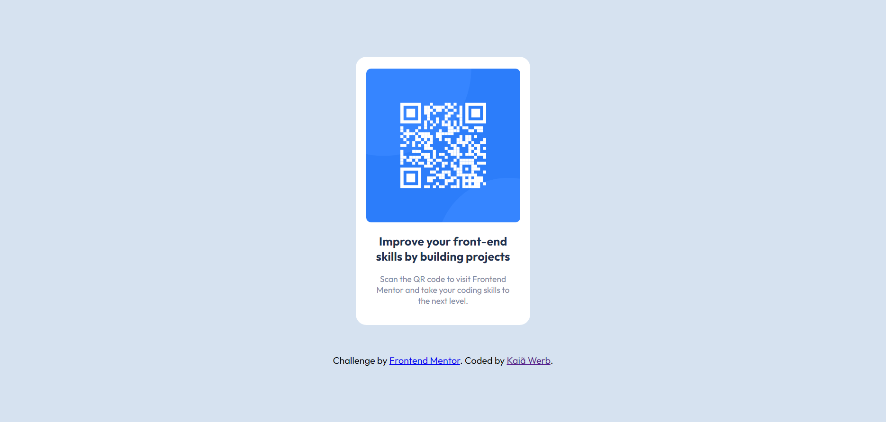

# Frontend Mentor - QR code component solution

This is a solution to the [QR code component challenge on Frontend Mentor](https://www.frontendmentor.io/challenges/qr-code-component-iux_sIO_H). Frontend Mentor challenges help you improve your coding skills by building realistic projects. 

## Table of contents

  - [Screenshot](#screenshot)
  - [Links](#links)
- [My process](#my-process)
  - [Built with](#built-with)
- [Author](#author)

### Screenshot

### Links

- Solution URL: [Here](https://kaiawerb.github.io/qr-cod-component/)

## My process

### Built with

- HTML5
- CSS
- Flexbox

## Author
- Kaiã Werb
- Frontend Mentor - [@kaiawerb](https://www.frontendmentor.io/profile/kaiawerb)
- Beacons - [@kaiawerb](https://beacons.ai/kaiawerb)
